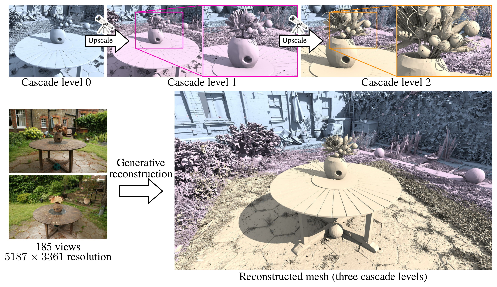

# T3lescope 🔭: Arbitrary-Resolution High-Fidelity Generative Surface Reconstruction from Images

Atsuhiro Noguchi<sup>1</sup>, Tianhan Xu<sup>1</sup>, Yiming Liang<sup>1</sup>, Yuta Kikuchi<sup>1</sup>, Masahiro Ishiyama<sup>1</sup>, Shintaro Takagi<sup>2</sup>, Hitoshi Murai<sup>2</sup>, Eiichi Matsumoto<sup>1</sup>

<sup>1</sup>Preferred Networks, Inc. &nbsp; <sup>2</sup>The University of Tokyo

[[arXiv]](https://arxiv.org/abs/XXXX.XXXXX) [[Project page]](https://pfnet-research.github.io/t3lescope/)



Code is coming soon.

## Abstract

We reconstruct high-fidelity 3D scene meshes from posed multi-view images without per-scene optimization, across scales ranging from single objects to large outdoor scenes. Per-scene optimization methods lack the learned 3D prior needed when observations are sparse or surfaces are glossy or transparent. Existing generative methods leverage such priors to complete geometry in sparsely observed regions, but typically operate at a fixed resolution over a limited spatial extent, trading spatial coverage against detail. Reconstructing a large scene therefore often requires partitioning it into independently processed overlapping local regions, making it difficult to maintain global geometric consistency.

To address these issues, we propose T3lescope, which applies a single fixed-resolution generator across scene scales in an inference-time coarse-to-fine cascade. A coarse level establishes the scene layout, and finer levels perturb and denoise geometry inherited from the coarser level within progressively finer spatial cells to recover surface detail. The model is trained on individual cells at multiple scales and shares its weights across all levels, so no hierarchy is fixed during training, and the number of levels, cell scales, and cell locations are determined at inference time.

On indoor, outdoor, and city-scale scenes, T3lescope outperforms feed-forward and generative baselines, matches or surpasses per-scene optimization, and recovers fine structures as well as glossy and transparent surfaces. These results show that our method generalizes across diverse scenes, view counts, and image resolutions.

## Citation

```bibtex
@article{noguchi2026t3lescope,
  title   = {T3lescope: Arbitrary-Resolution High-Fidelity Generative Surface Reconstruction from Images},
  author  = {Noguchi, Atsuhiro and Xu, Tianhan and Liang, Yiming and Kikuchi, Yuta and Ishiyama, Masahiro and Takagi, Shintaro and Murai, Hitoshi and Matsumoto, Eiichi},
  journal = {arXiv preprint arXiv:XXXX.XXXXX},
  year    = {2026}
}
```
